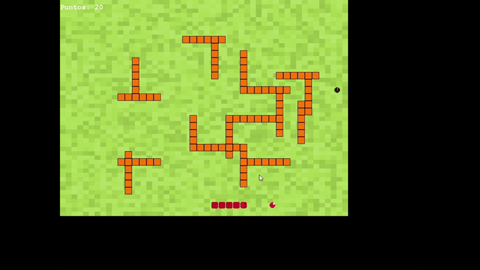

# Super-Snake-DS
Un clon de Snake con estructuras de datos personalizadas aplicando la lista doblemente enlazada para el proyecto final de Estructuras de Datos.
## Instrucciones para la apertura del juego:
1. Descarga el archivo zip del repositorio
2. Descomprime el archivo
3. Abre la carpeta en tu editor de código
4. Elimina el archivo README
5. Descarga pygame si aun no lo tienes con el comando "pip install pygame" en la terminal
6. Selecciona el archivo main.py y correlo
7. Disfruta

## Estructura general
```
/SuperSnakeDS/
├── main.py         # ⬅️ Lógica principal, bucle (GameApp), y control de pantallas.
└── /snake_game/   
│   ├── __init__.py  
│   ├── logica.py # ⬅️ Clases de juego (Snake, AssetManager, SoundSynth, SKINS).
│   ├── configuracion.py # ⬅️ Todas las constantes, dimensiones, colores, dificultades.
│   └── estructuras_de_datos.py # ⬅️ Estructuras de datos (DoublyLinkedList) y Enums (FoodType).
├── savegame.json   # ⬅️ Archivo de datos guardados (monedas, skins).
└── /Musica/        
    ├── a-video-game-248444.mp3
    ├── Lexica   Press X Twice (Royalty Free Music).mp3
    └── A Lil BIT.mp3
```
## Descripción
Super Snake DS es una reinterpretación moderna del clásico arcade Snake, desarrollado en Python utilizando la librería Pygame. 

🎯 Puntos Clave:
- Aplicación Práctica de Estructuras de Datos: El movimiento, crecimiento y colisión de la serpiente demuestran la eficiencia de la DoublyLinkedList para operaciones de inserción y eliminación en los extremos.

- Contenido Dinámico: Incluye múltiples tipos de comida (FoodType) que añaden elementos estratégicos y retos al juego.

- Persistencia de Datos: Utiliza el módulo os y archivos JSON para implementar un sistema de guardado y carga persistente, manteniendo el progreso del jugador, las puntuaciones altas y los skins desbloqueados.

## Papel de las estructuras de datos:

- **Clase DoublyLinkedList** (Lista Doblemente Enlazada):

    - **Función**: Es la estructura de datos fundamental que representa el cuerpo de la serpiente.

    - **Manejo de Datos**: Cada nodo en esta lista enlazada almacena la posición (coordenadas) de un segmento del cuerpo de la serpiente.

    - **Operaciones**: Permite realizar inserciones y eliminaciones rápidas en ambos extremos, crucial para:

        - **Movimiento**: Eliminar el nodo de la cola (último segmento) y agregar un nuevo nodo a la cabeza (nueva posición de la cabeza) en cada tick del juego.

        - **Crecimiento**: Solo agregar un nuevo nodo a la cabeza sin eliminar la cola.
 
- **Enum FoodType** (Enumeración del Tipo de Comida):

    - **Función**: Una enumeración es una estructura de datos que define un conjunto de constantes discretas.

    - **Manejo de Datos**: Almacena los diferentes tipos de comida (ej: Normal, Puntos extra, Veneno) y sus valores asociados, permitiendo que el código trabaje con nombres legibles en lugar de números crudos.

 ### Ejemplo gráfico de la jugabilidad:

